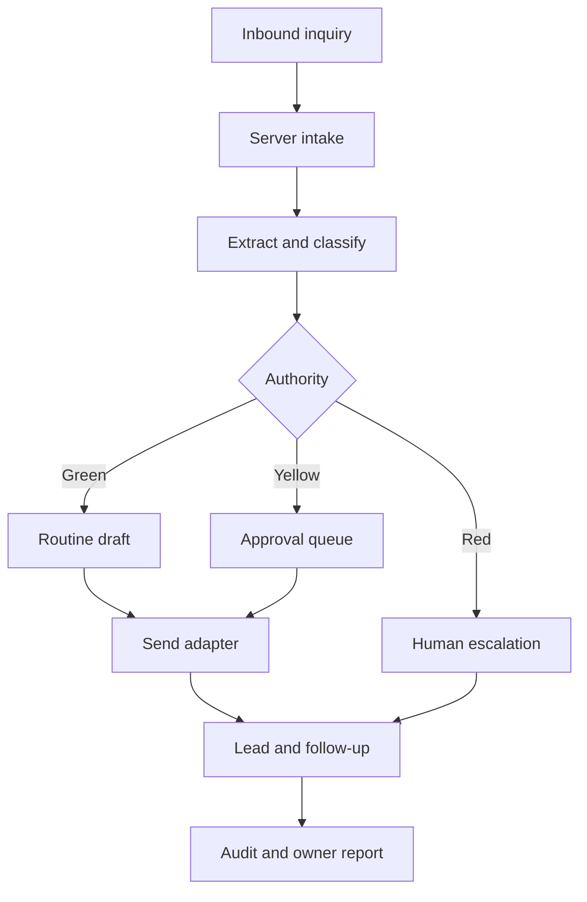

# Architecture

## Outcome

The first milestone is a private, single-customer demonstration with a real vertical workflow and production-oriented boundaries. It deliberately avoids a generalized automation platform.

## Runtime layers

| Layer | Current implementation | Production boundary |
| --- | --- | --- |
| Web | Vinext/Next-compatible React, responsive dashboard | Same UI can remain; customer auth becomes externally accessible and tenant-aware |
| Intake | Web form/demo API | Gmail forwarding/API and website webhook adapters |
| Decision engine | Deterministic extraction and safety rules | OpenAI structured output, validated against the same authority policy |
| Data | D1 for private demonstration | Supabase Postgres with RLS before real customer data |
| Send | Explicit simulation | Gmail adapter with idempotency and narrowly scoped OAuth |
| Calendar | Appointment request wording only | Google Calendar free/busy; no commitment without configured authority |
| Billing | Documented only | Stripe payment link/invoice until self-service is justified |
| Audit | Append-only activity records | Append-only audit table, restricted writes, retention policy |

## Key boundaries

- Browser code never receives database service credentials or OAuth refresh tokens.
- Every repository operation takes a tenant identifier from authenticated server context, never from an untrusted request body.
- All outbound messages pass the authority gate before the send adapter.
- AI output is treated as untrusted structured input and validated before storage or action.
- Integrations implement idempotency keys, bounded retries, and visible failure states.
- Raw inbound content is retained only as required by the customer retention policy.

## Failure behavior

- Model unavailable: store the inquiry, mark drafting failed, notify staff, retry safely.
- Email unavailable: keep approved message unsent, expose the failure, never mark contacted.
- Calendar unavailable: ask for preferences without promising a slot.
- Duplicate inquiry: use provider message ID or normalized contact/time fingerprint; link duplicates instead of creating parallel follow-up sequences.
- Tenant mismatch: reject server-side and record a security audit event without disclosing whether the target exists.

## Deliberate exclusions

No vector database, workflow framework, queue cluster, microservices, Kubernetes, custom subscription portal, automated diagnosis, or advanced analytics is included.
