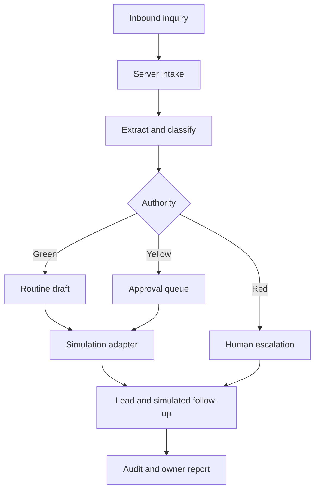

# Architecture

## Outcome

This repository is a fail-closed, authenticated, role-aware simulation. It deliberately avoids live providers and does not claim customer-data or production readiness.

## Runtime layers

| Layer | Current implementation | Production boundary |
| --- | --- | --- |
| Web | Vinext/Next-compatible React, responsive dashboard, Sites SIWC gate | External customer identity strategy still requires launch review |
| Intake | Web form/demo API | Gmail forwarding/API and website webhook adapters |
| Decision engine | Deterministic extraction and safety rules | OpenAI structured output, validated against the same authority policy |
| Data | D1 persistence with server-derived membership and roles | Apply and integration-test Supabase Postgres RLS before real customer data |
| Send | Atomic, idempotent simulation ledger; no live delivery | Gmail adapter with idempotency and narrowly scoped OAuth only after separate approval |
| Calendar | Appointment request wording only | Google Calendar free/busy; no commitment without configured authority |
| Billing | Documented only | Stripe payment link/invoice until self-service is justified |
| Audit | Server-only append records committed with the action | PostgreSQL hash-chain trigger, export, retention, backup and monitoring |

## Key boundaries

- Browser code never receives database service credentials or OAuth refresh tokens.
- Every repository operation takes a tenant identifier from authenticated server context, never from an untrusted request body.
- All outbound messages pass the authority gate before the send adapter.
- AI output is treated as untrusted structured input and validated before storage or action.
- Integrations implement idempotency keys, bounded retries, and visible failure states.
- Raw inbound content is retained only as required by the customer retention policy.
- The UI never substitutes local/generated success data for a failed database operation.

## Failure behavior

- Model unavailable: store the inquiry, mark drafting failed, notify staff, retry safely.
- Email unavailable: keep approved message unsent, expose the failure, never mark contacted.
- Calendar unavailable: ask for preferences without promising a slot.
- Duplicate inquiry: use provider message ID or normalized contact/time fingerprint; link duplicates instead of creating parallel follow-up sequences.
- Tenant mismatch: reject server-side and record a security audit event without disclosing whether the target exists.

## Deliberate exclusions

No vector database, workflow framework, queue cluster, microservices, Kubernetes, custom subscription portal, automated diagnosis, or advanced analytics is included.
