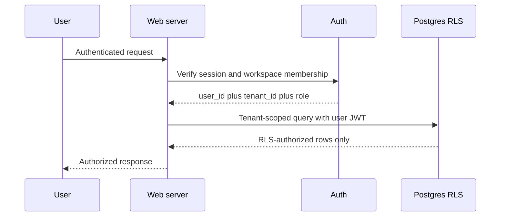

# Tenant Security Model

## Non-negotiable invariants

1. Tenant identity comes from authenticated server context, not form data, query parameters, model output, or browser storage.
2. Every business-owned row contains `tenant_id`.
3. Every read, insert, update, and delete is tenant-scoped.
4. Production Postgres enables RLS on every tenant table; no browser client receives a service-role key.
5. Integration secrets are server-only, encrypted at rest, minimally scoped, revocable, and excluded from logs.
6. Cross-tenant identifiers return a generic not-found response and generate an audit/security event.
7. Audit events record actor, role, tenant, action, authority, target, correlation, and timestamp.

## Production authorization flow

Sites SIWC authenticates browser and API requests. The server normalizes the authenticated email and resolves exactly one membership from `tenant_memberships`; no request body or query parameter selects the tenant. Missing authentication, missing membership, ambiguous membership, and database errors all deny access.

The running D1 implementation enforces tenant and role rules in server-only repositories. The role-aware PostgreSQL RLS design lives in `db/supabase-production.sql`; it is not yet applied to a Supabase environment and must not be represented as deployed protection.

## Roles

- Owner: settings, integrations, billing links, all leads, reports, approvals.
- Manager: leads, approvals, rules, reports; no billing/ownership transfer.
- Advisor: assigned leads, drafts, send/approve within configured policy.
- Viewer: read-only dashboards and reports.

Only owner, manager, and advisor may create inquiries or approve non-Red drafts. All draft-state, approval, send, follow-up, and audit writes remain server-only. Red authority is recomputed from the stored lead, stored draft, and edited outbound body immediately before the transaction.

## Security tests

- Tenant A token cannot read, update, approve, export, or infer Tenant B records.
- Changing a body/query `tenant_id` has no effect.
- Service credentials are absent from browser bundles.
- Red actions remain blocked even if the client request is modified.
- Audit events cannot be altered through customer-facing routes.
- A persistence error creates no client-side success state and no partial approval/send artifacts.
