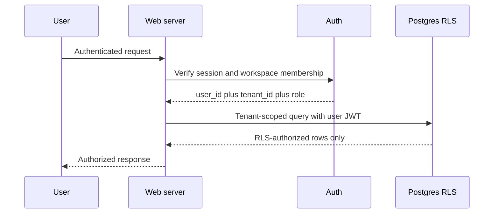

# Tenant Security Model

## Non-negotiable invariants

1. Tenant identity comes from authenticated server context, not form data, query parameters, model output, or browser storage.
2. Every business-owned row contains `tenant_id`.
3. Every read, insert, update, and delete is tenant-scoped.
4. Production Postgres enables RLS on every tenant table; no browser client receives a service-role key.
5. Integration secrets are server-only, encrypted at rest, minimally scoped, revocable, and excluded from logs.
6. Cross-tenant identifiers return a generic not-found response and generate an audit/security event.
7. Audit events record actor, tenant, action, authority, target, and timestamp.

## Production authorization flow

The reference production policies live in `db/supabase-production.sql`. The private demo's fixed tenant context is not valid for production customer data.

## Roles

- Owner: settings, integrations, billing links, all leads, reports, approvals.
- Manager: leads, approvals, rules, reports; no billing/ownership transfer.
- Advisor: assigned leads, drafts, send/approve within configured policy.
- Viewer: read-only dashboards and reports.

## Security tests

- Tenant A token cannot read, update, approve, export, or infer Tenant B records.
- Changing a body/query `tenant_id` has no effect.
- Service credentials are absent from browser bundles.
- Red actions remain blocked even if the client request is modified.
- Audit events cannot be altered through customer-facing routes.
